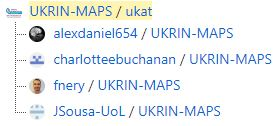
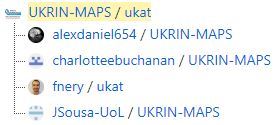

# Renaming `UKRIN-MAPS` repository to `ukat`

## What is this?
This documents the steps @fnery took when renaming the UKRIN-MAPS repository (now named `ukat`) while trying to avoid breaking stuff :smile:.

Users are encouraged to rename their own forks to reflect the rename of the `upstream` repository. To do this, follow steps 1, 2, 4, 5 below. 6 is optional, but recommended. Step 7 was to confirm all of the below is correct and worked, but is not necessary.

:warning: Please ensure URLs and other mentions to the `fnery` github account name are updated to match your own github account name (e.g. when updating remotes)

**Note**: Commands starting with `$` indicate commands run on the bash shell.

### 1. Ensure `origin` even with `upstream`
That is: ensured that my remote branch ([`origin`](https://github.com/fnery/UKRIN-MAPS)) is even with the UKRIN-MAPS remote master branch ([`upstream`](https://github.com/UKRIN-MAPS/UKRIN-MAPS)) by going to [`origin`](https://github.com/fnery/UKRIN-MAPS) and confirming it says "`This branch is even with UKRIN-MAPS:master.`"

### 2. Ensure local clone of `origin` even with `origin`
    $ pwd
    /mnt/d/fnery/github/forks/UKRIN-MAPS

    $ git status
    On branch master
    Your branch is up to date with 'origin/master'.

    nothing to commit, working tree clean

### 3. Rename `UKRIN-MAPS` repository to `ukat`
Done on GitHub on the browser (inside [`upstream`](https://github.com/UKRIN-MAPS/UKRIN-MAPS), settings tab).

Renamed worked. Note that the forks are not renamed automatically:

### 4. Rename `origin`

Done on GitHub on the browser (inside [`origin`](https://github.com/fnery/UKRIN-MAPS), settings tab).

Renamed worked. Look at forks again to confirm:

### 5. Update remotes of local clone of `origin`

Check the remotes before updating:

    $ git remote -v
    origin  https://github.com/fnery/UKRIN-MAPS.git (fetch)
    origin  https://github.com/fnery/UKRIN-MAPS.git (push)
    upstream        https://github.com/UKRIN-MAPS/UKRIN-MAPS.git (fetch)
    upstream        https://github.com/UKRIN-MAPS/UKRIN-MAPS.git (push)

Clearly they still point to the old URLs. To update them, do:

    $ git remote set-url origin https://github.com/fnery/ukat.git
    $ git remote set-url upstream https://github.com/UKRIN-MAPS/ukat.git

Confirm remotes were updated:

    $ git remote -v
    origin  https://github.com/fnery/ukat.git (fetch)
    origin  https://github.com/fnery/ukat.git (push)
    upstream        https://github.com/UKRIN-MAPS/ukat.git (fetch)
    upstream        https://github.com/UKRIN-MAPS/ukat.git (push)

Update is OK.

### 6. Rename local directory where the clone of `origin` lives

This is because the local directory should still have the old repository name:

    $ pwd
    /mnt/d/fnery/github/forks/UKRIN-MAPS

So rename it and go back into it:

    $ cd ..
    $ mv UKRIN-MAPS/ ukat
    $ cd ukat/
    $ pwd
    /mnt/d/fnery/github/forks/ukat

### 7. Make one test pull request to check all worked

To check all worked, make a local commit, push it to `origin` (now updated to https://github.com/fnery/ukat) and then submit it as a PR to `upstream` (now updated to https://github.com/UKRIN-MAPS/ukat).

The commit will contain a new `misc` directory placed in the root of the repository which will contain this document.
